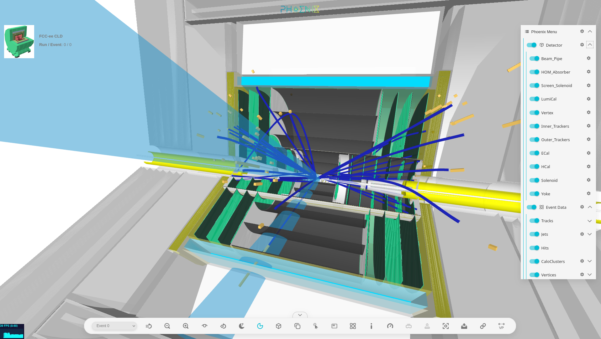

# Visualization

## Phoenix@FCC

[Phoenix](https://github.com/HSF/phoenix) is a web based event display for High
Energy Physics. To visualize FCC events one needs to provide detector geometry
and generated events --- event data.

In this tutorial we will be working with files stored on two computers. First
computer will be the one which can source FCCSW stack, e.g. `lxplus` and second
one will be yours with the recent web browser. We will call the first one the
_remote machine_ and the second one the _local machine_.


## Event Data

### CLD Reconstructed Events

Let's start with the visualization of the event data in the established detector
design CLD, which started its life as the detector designed for the CLIC linear
collider concept. The detectors in FCCSW are described in
[DD4hep](https://dd4hep.web.cern.ch/dd4hep/) compact files. The compact files
are written in XML and expose configuration options for the detector.

Example CLD compact file can be examined after sourcing of the FCCSW stack on
the remote machine
```sh
source /cvmfs/fcc.cern.ch/sw/latest/setup.sh
```
like so
```sh
less ${FCCDETECTORS}/Detector/DetFCCeeCLD/compact/FCCee_o2_v02/FCCee_o2_v02.xml
```
This is a copy of the
[FCCDetectors](https://github.com/HEP-FCC/FCCDetectors/blob/main/doc/DD4hepInFCCSW.md#visualisation)
repository, which stores FCC detector designs.

The Phoenix web application already showcases the CLD detector
[here](https://fccsw.web.cern.ch/fccsw/phoenix/#/fccee-cld/) and we will
simulate few events in order to visualize them there.

On the remote machine we will need to clone the
[CLICPerformance](https://github.com/iLCSoft/CLICPerformance) repository
```sh
git clone https://github.com/iLCSoft/CLICPerformance
cd CLICPerformance/fcceeConfig
```

run the simulation
```sh
ddsim --compactFile $LCGEO/FCCee/compact/FCCee_o1_v04/FCCee_o1_v04.xml \
      --outputFile tops_edm4hep.root \
      --steeringFile fcc_steer.py \
      --inputFiles ../Tests/yyxyev_000.stdhep \
      --numberOfEvents 7
```

and after that, run the reconstruction with the help of
[this](./fccRec_e4h_input.py) steering file
```sh
wget https://hep-fcc.github.io/fcc-tutorials/_downloads/e88cc1443945cfce03b3957f319c2288/fccRec_e4h_input.py
k4run fccRec_e4h_input.py
```

There should be a file called `tops_cld.root` in your working
directory.

In order to visualize the events from this file we need co convert the
[EDM4hep](https://edm4hep.web.cern.ch/) ROOT file into intermediate JSON format
with the command:
```ssh
edm4hep2json tops_cld.root
```

:::{admonition} EDM4hep Collections
:class: callout
One should specify a list collections to be exported with the `-l` flag. The
default ones are:
* `GenParticles`
* `BuildUpVertices`
* `SiTracks`
* `PandoraClusters`
* `VertexJets`
* `EventHeader`
:::

Now we download the obtained file from the remote machine into our local one.
Most easily done with `scp`
```sh
scp lxplus.cern.ch:CLICPerformance/fcceeConfig/tops_cld.edm4hep.json .
```

To load the EDM4hep JSON file into the
[Phoenix](https://fccsw.web.cern.ch/fccsw/phoenix/#/fccee-cld/) use the upload
button in the lover right corner of the web page

```{image} phoenix_upload.png
:align: center
```

The detector and event data might look similar to this screenshot



:::{admonition} EDM4hep JSON File
:class: solution dropdown
The obtained EDM4hep JSON file should look similar to
[this one](./tops_cld.edm4hep.json) [Right click to download].
:::


## Delphes Full Simulation

TBA

## Detector Geometry

There are several ways how to import FCC detector geometry into Phoenix.
Currently the most preferred method is to convert compact DD4hep file(s) to
ROOT files and from ROOT files to GLtf files. The first conversion
(`.xml` -> `.root`) is straightforward and can be done using script like this:

```python
#!/usr/bin/env python3

import sys
import argparse


def main():
    parser = argparse.ArgumentParser(description='Convert detector')
    parser.add_argument('-c', '--compact', help='Compact file location(s)',
                        required=True, type=str, nargs='+')
    parser.add_argument('-o', '--out', help='Converted file path',
                        default='detector.root', type=str)
    args = vars(parser.parse_args())

    convert(args['compact'], args['out'])


def convert(compact_files, out_path):
    print('INFO: Converting following compact file(s):')
    for cfile in compact_files:
        print('      ' + cfile)

    import ROOT

    ROOT.gSystem.Load('libDDCore')
    description = ROOT.dd4hep.Detector.getInstance()
    for cfile in compact_files:
        description.fromXML(cfile)

    ROOT.gGeoManager.SetVisLevel(9)
    ROOT.gGeoManager.SetVisOption(0)
    ROOT.gGeoManager.Export(out_path)


if __name__ == '__main__':
    main()

```

Second conversion (`.root` -> `.gltf`) requires inclusion of additional
information about the geometry and is done using the
[root_cern-To_gltf-Exporter](https://github.com/HSF/root_cern-To_gltf-Exporter).
One can create hierarchy menu, suppress drawing of volumes which are too small
and so on. The example for FCCee Lar Calo:

```html
<html>

  <head>
    <script src="https://unpkg.com/three@0.139.1/build/three.js"> </script>
    <script src="https://unpkg.com/three@0.139.1/examples/js/exporters/GLTFExporter.js"> </script>
    <script src="https://root.cern/js/latest/scripts/JSRoot.core.js"> </script>
    <script src="https://cdnjs.cloudflare.com/ajax/libs/FileSaver.js/1.3.8/FileSaver.js"></script>
  </head>

<body>
  <script type="module">

    import { convertGeometry } from './phoenixExport.js';

    var hide_children = [
      "passive_",
      "active_",
      "PCB_"
    ];

    // for each level of hierarchy in the phoenix menu, tell which parts of the geometry to
    // use and whether they are initially visible or not.
    var subparts = {
        "Cryo > Front" : [["ECAL_Cryo_front_0"], .8],
        "Cryo > Back" : [["ECAL_Cryo_back_1"], .8],
        "Cryo > Sides" : [["ECAL_Cryo_side_2"], .8],
        "Services > _Front" : [["services_front_3"], .6],
        "Services > _Back" : [["services_back_4"], .6],
        "Bath": [["LAr_bath_5"], true]
    }

    convertGeometry("./fccee-lar-ecal.root", "fccee-lar-ecal.gltf",
                    4, subparts, hide_children, "default", 120);

  </script>
</body>
```

Already converted geometry for the FCCee LAr Calorimeter imported into Phoenix
application can be found [here](https://kjvbrt.github.io/fcc-viewer/).


