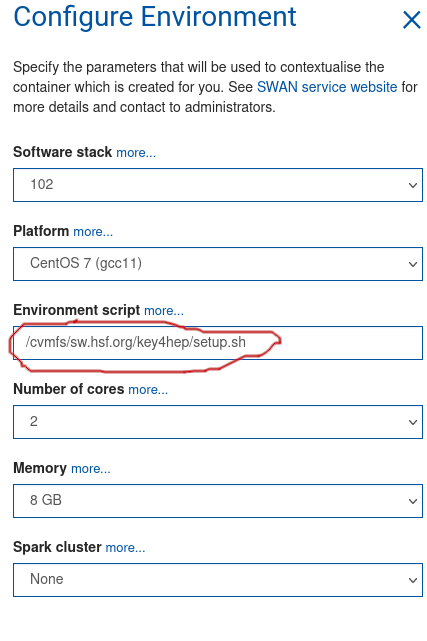

# Running the software in SWAN notebooks 


:::{admonition} Learning Objectives
:class: objectives

* Learn how to run tutorials in SWAN notebooks 
:::

SWAN is a web service for running jupyter notebooks at CERN, and is a very convenient way of running tutorials if one has a CERN computing account.

SWAN can be used only with a browser and is reached by visiting <http://swan.cern.ch> . 

After logging in, SWAN will ask you to configure your session. The default software stack (`102` at the moment can be kept, but to use the Key4hep, software the following environment script has to be used:
```

/cvmfs/sw.hsf.org/key4hep/setup.sh
```



Documentation on how to use notebooks is easy to find online (<https://jupyter-notebook.readthedocs.io/en/latest/notebook.html>). Basically, the code cells behave like a muli-line python prompt (as in ipython) and can be executed with `Shift+Enter`. Variables are kept between cells, and the working directory is persistent too - notebooks are run in your eos user directory under `/eos/user/v/vavolkl/SWAN_projects/` (substitute `v` and `vavolkl` for your username initial and username).

The default kernel is running python3, but you can run general bash commands as well, either by prefixing a command with an exclamation mark

```
!ls
```
or the bash cell magic (works for multiple files):

```
%%bash
ls
```

Setting environment variables will be only effective for the current cell though.


Plots can be drawn directly in the notebooks, see for example
<https://cern.ch/swanserver/cgi-bin/go?projurl=https://root.cern.ch/doc/master/notebooks/fillrandom.py.nbconvert.ipynb>
